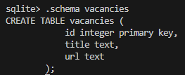
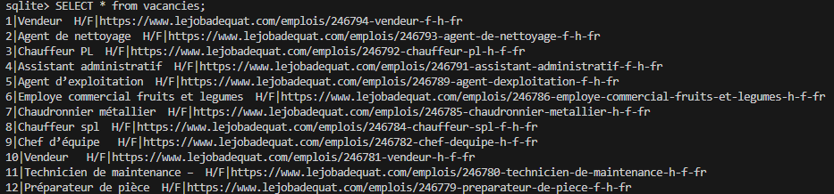

## Link

[https://www.lejobadequat.com/emplois](https://www.lejobadequat.com/emplois)

## Task

- За допомогою бібліотеки requests отримати контент першої сторінки сайту https://www.lejobadequat.com/emplois
- За допомогою бібліотеки re отримати всі назви вакансій та посилання (url)
- Зберегти результат у форматі JSON
- Зберегти результат в базі даних SQLite

## Solution

- [Extracting, saving as JSON and SQLite](get_vacancies.py)

## Output

### JSON

- [lejobadequat-emplois.json](lejobadequat-emplois.json)

### SQLite

- [lejobadequat-emplois.db](lejobadequat-emplois.db)

